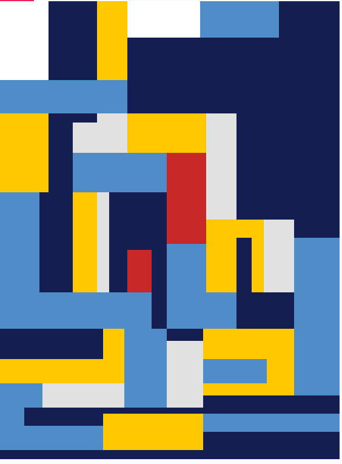

# pensamiento-computacional_sec3
ejercicios y entregas curso pensamiento computacional

## sobre este repositorio

## sketch 1 . mi primer p5.js

-que intente hacer: una copia de pintura de ¨¨Afonso : Geometria sagrada en abstracto¨¨
- que aprendi: Aprendi a memorizar codigos de colores y formas , al igual que manejar las cOordenadas X e Y 
- que no salio: las medidas exactas se me complicaron bastante , no es 100% identico al original en cuanto a tamaños.
- 
## ¿Por qué elegí esta obra?

Elegi esta obra porque me gustaron sus colores y formas rectangulares , aparte de que tiene muchas figuras de distintos tamaños que aumentaron su complejidad de recreacion.

## Coordenadas
Para ver las coordenadas puse la imagen en CANVA junto con ILLUSTRATOR y con las herramientas de medicion fui sacando X e Y , sin embargo, fue bastante complicada esta interaccion.

## Como resolví
Para resolver de alguna manera el tema de las medidas fui tanteando entre numeros cercanos como 140, 145, 150.. etc para que me calzaran la mayoria de las figuras.

## Reflexión y opiniones
Tuve que tener mucha paciencia en este trabajo ya que me equivoque muchas veces, al igual que tuve que organizar lo que iba primero, despues, etc. Mejore mi forma de escribir codigo y organizacion con mi trabajo , al igual que desarrolle una mejor observacion y atencion a lo que estoy creando.

